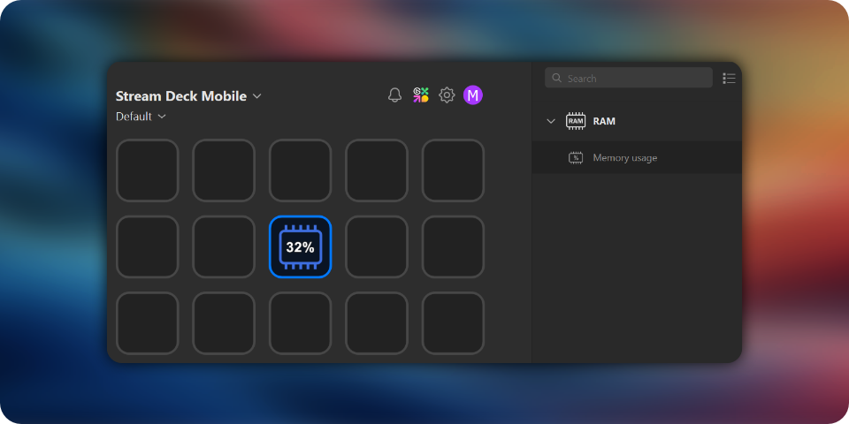

# Stream Deck RAM Usage Plugin

This Stream Deck plugin displays the current memory usage of your system. It is designed to provide real-time updates on your Stream Deck device, allowing you to monitor your system's RAM usage at a glance.



## Features

- Real-time RAM usage display
- Easy to install and configure
- Customizable icon and title font

## Installation

1. Download the latest release from the [Releases](https://github.com/dirondin/streamdeck-ram/releases) page.
2. Open the downloaded `.streamDeckPlugin` file with the Stream Deck application.

## Usage

1. Open the Stream Deck application.
2. Find the "RAM" category in the actions list.
3. Drag the "Memory usage" action to a key on your Stream Deck.

## Building and Packaging

To build and package the plugin from source using CMake, follow these steps:

1. Clone the repository:
    ```sh
    git clone https://github.com/dirondin/streamdeck-ram.git
    cd streamdeck-ram
    ```

2. Configure the project using CMake:
    ```sh
    cmake -S . -B build
    ```

3. Build the project:
    ```sh
    cmake --build build
    ```

4. Deploy the unpacked plugin in the `build` directory:
    ```sh
    cmake --build build --target deploy
    ```

5. Validate and package the plugin with Elgato CLI tools (requires installed Node.js) in the `build` directory:
    ```sh
    cmake --build build --target plugin-validate
    cmake --build build --target plugin-pack
    ```

6. OPTIONAL: To install the plugin directly to the StreamDeck plugins folder, use the following steps:
    ```sh
    cmake -S . -B build -D SET_INSTALL_PREFIX_TO_STREAMDECK_PLUGIN_DIR=ON
    cmake --build build --target install
    ```

This will generate a `.streamDeckPlugin` file in the `build` directory, which you can then install by following the installation instructions above.

## Based on

This plugin is based on the [Elgato CPU plugin](https://github.com/elgatosf/streamdeck-cpu) and [StreamDeckSDK](https://github.com/fredemmott/StreamDeck-CPPSDK).

## Support

If you encounter any issues or have any questions, please open an issue on the [GitHub repository](https://github.com/dirondin/streamdeck-ram/issues).

## License

This project is licensed under the MIT License. See the [LICENSE](https://github.com/dirondin/streamdeck-ram/blob/master/LICENSE) file for details.